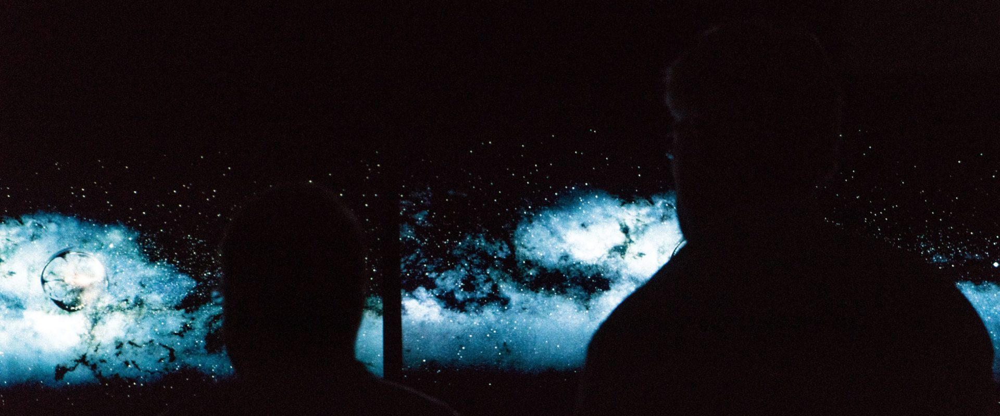

Big shout out and thank you to Vincent Teoh at [HDTVtest ](http://www.hdtvtest.co.uk/)and [Crampton & Moore ](http://www.cramptonandmoore.co.uk/leeds)who hosted this awesome event!

This is a follow up to my original post on the subject, which you can read here: [/audio-visual/2017/4k-hdr-tv-shootout-part-i/](/audio-visual/2017/4k-hdr-tv-shootout-part-i/)

The TVs being showcased were as follows:

* LG B7 (OLED65B7V) OLED TV – £3899
* Panasonic EZ1002 (TX-65EZ1002B) OLED TV – £5999
* Samsung Q9 (QE65Q9F) QLED TV – £4499
* Sony A1 (KD-65A1) OLED TV – £4499
* Sony ZD9 (KD-65ZD9) LED LCD TV – £3299

I’m probably not going to go into huge detail on each model and the differences between them, and that’s because in all honesty, there was very little difference between them – they’re all pretty darn good TVs (which you would expect for their cost!)

## The Shootout

The day consisted of two sessions of approx 2.5 hours where we evaluated each of the TVs on a number of different aspects, these included black levels, white levels, colour accuracy, how good each screen looked in dark environments, bright environments. We looked at how each TV handled HD content from blurays and TV broadcast as well as 4K Gaming and 4K HDR content. We were also able to compare the images on the TVs to those on a Sony BVM-X300 Professional Broadcast Monitor (worth in excess of £30K) – this is the screen used by filmmakers to colour correct films and master Blu-rays, and it is as good as screen technology gets.

I should mention each of the TVs and the Broadcast monitor had been professionally calibrated by Vincent Teoh, with help from Tyler Pruitt from SprectraCal and for many of the rounds, the differences were so minute it was almost impossible to rank the TVs from best to worst.

<figcaption>Trying to spot the difference in black levels between two OLED TVs.</figcaption>

The similarities especially in standard dynamic range content were unreal – a testament to how good a calibration Vincent and Tyler pulled off. Calibration is probably the biggest thing I took from the day – proper calibration is about the most important thing you can do to any of these TVs and it will make way more difference than anything else to how enjoyable watching content is on them!

## So which TV was the best?

That really is a difficult question. Some of the voting was so close, and kind of opinionated – in some rounds a TV got scores of 5 from some people and 1 from others, so its difficult, no impossible to categorically say which TV is the best – I’m sure the next HDTVtest video will go into this in a lot more detail, so I won’t repeat what Vincent is likely to say, but I will give my opinion!

There was one TV which in my opinion stood out, but not because it was the best. I could single out the Samsung Q9 as being the worst of the bunch – but it could have been a duff panel in the set we looked at, its colours weren’t quite as good as the others and it suffered from poor uniformity in darker scenes. It also seemed to have more fiddly colour profiles than the rest, requiring more frequent trips through the menu to change settings for different types of content. The rest of the screens can be split into two groups – the 3 OLEDs and the ZD9. I’ll come back to the ZD9 in a minute…

## OLEDs

All three of the OLEDs on display use panels made by LG – most likely the specification of each panel is identical and the only differences we could see were manufacturing tolerance and the differences in image processors. Talking of image processors, there was no stand out as the best in all situations – they all shined in certain areas, the Sony for example has an amazing feature which looks for posterisation and gradients which lack the colour data to be smooth and fixes them – its kind of magic and does an incredible job. The Sony also did a very good job of colour reproduction – it was just beaten by the Panasonic which was slightly better. The LG wasn’t far behind and it excelled in HDR content (for an OLED).

OLEDs with their properly black blacks undisputedly look the best in a fully dark room – but with any daylight or lights on in the room, that benefit is kind of lost and shadow detail all kind of disappears into the inky blackness… Not everyone wants to turn their living room into a bat-cave to watch movies – maybe for*Lego Batman*.

With HDR content mastered to 1000nits they all did a pretty good job, but with the 4000 nit titles we watched – they struggled to have the same impact the much brighter LCD tvs managed.

## The Sony ZD9

Despite being the ‘cheapest’ (yeah I know £3299 isn’t cheap), I was seriously impressed with the Sony ZD9 – it held its own with SDR content – I preferred the brighter shadow detail in dark scenes – made it easier to see without blackening the entire room. Colour reproduction was good – the only problem being if you were more than 10 degrees off to the side as it has quite a narrow viewing angle where the colours aren’t affected – but if you can sit directly in front of this TV, it will do an excellent job.

With HDR, there really isn’t a comparison to the OLEDs – this thing will knock your socks off – the sparks in one of the scenes from*Batman vs Superman*at 1800 nits almost hurt to look at – you can almost feel the heat of explosions – this is what HDR is all about – this TV has the ‘wow’ factor. In all honesty, If they ever make a TV capable of the 4000 nits that HDR10 is capable of, I think you might need to wear sunglasses… I don’t even want to think about 10000 nits of Dolby Vision…

## HDR is it worth it?

The future is bright and full of colours – HDR is as good as I thought it would be – screens capable of 1800 nits like the Sony ZD9 are a great showcase of the future of home entertainment. Watching a clip from*Pacific Rim*, which has big robot suits that fight with neon lights and lasers (I apologies I haven’t seen the film and have no idea what was going on) was absolutely stunning with incredible vivid highlights.

We got to watch a short scene from*Power Rangers*in Dolby Vision, which promises to be even better than HDR10, but its a bit of a moot point.*Power Rangers*is currently one of the three titles available in the UK in Dobly Vision, the other two being*Despicable Me*and*Despicable Me 2*…

I’m sure in the next couple of years, this will all sort itself out, TV technology will continue to improve – I can’t wait to see what an OLED looks like that is capable of 2000 nits – but that may well be a while off.

Is it the right time to jump into HDR? I don’t know – we’ve seen bigger improvements in TVs in the last 2 years than in the previous 8, so it might be worth waiting to see what next year’s models bring…

## Conclusion

Judging by the varied responses of the attendees – I’d say that choosing an HDR TV is quite a personal thing – so my advice would be go and see the TVs you want to see (properly calibrated if you can)…

In my opinion if you wanted a TV for a home theatre environment, one where you would always use blackout blinds, then an OLED might be the best for you – out of the ones we compared, I’d go for the cheapest as there isn’t enough of a difference between them to warrant the price differences.

For me, I was really impressed by the ZD9 with its HDR prowess. It definitely had the ‘wow’ factor and for me that’s kind of what HDR is all about – its also getting a firmware update soon to support Dolby Vision, so it should be future proof too.

<figcaption>Vincent Teoh</figcaption>

Finally, a huge thanks to Vincent – it was a really interesting and informative day, I learned a lot and it was clear he put a huge amount of effort into the preparation of this event!