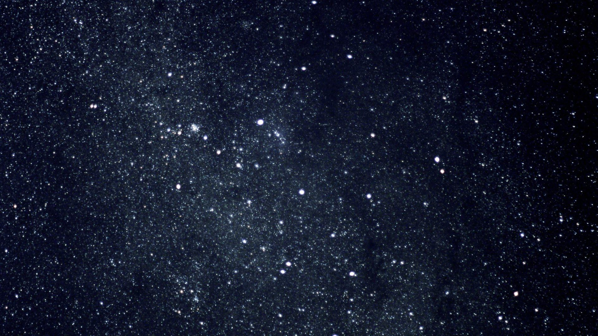
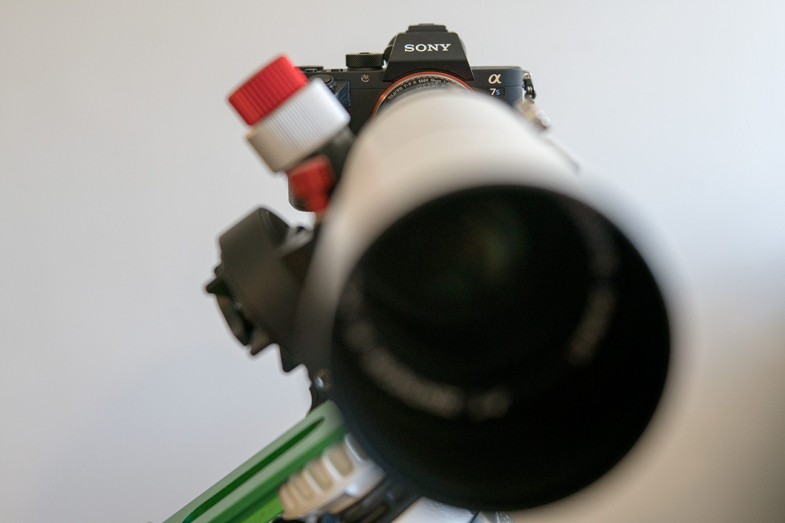

import orionV2 from '~/assets/images/a-beginners-guide-to-astrophotography/orion-nebula_v2.jpg';
import orionV3 from '~/assets/images/a-beginners-guide-to-astrophotography/orion-nebula_v3.jpg';
import rosette1 from '~/assets/images/a-beginners-guide-to-astrophotography/rosette-stacked.jpg';
import rosette2 from '~/assets/images/a-beginners-guide-to-astrophotography/rosette-final.jpg';

Let me preface this by saying that this is a guide written by a beginner, rather than a guide for beginners, although I hope it is at least of some interest to people looking to get into this amazing hobby. Astrophotography is probably one of the most technically demanding types of photography; requiring specialist equipment, many hours of both imaging and processing, and a whole lot of patience!

My first proper photographs of space were taken at Mount John Observatory in New Zealand (South Island). Located in one of the darkest regions of a sparsely populated country gives incredible views of the stars. It’s no wonder that the Mount John Observatory is home to New Zealand’s largest telescope – the 1.8m MOA telescope. Sadly we didn’t get to see it as it’s used for ‘research’. We did get to use a 0.4m Meade LX200 telescope to observer Jupiter and the Galilean moons.

They also had a tracking mount set up so we could put our own cameras on it and take some long exposures without star trails.

These images were taken with a Panasonic GH1, a relatively old digital camera, not ideally suited to astrophotography, but on a tracking mount with 30 second exposures, you can see quite a lot.

## 1. Tracking Mount

A sky tracking mount is probably the most important piece of equipment, and vital for photographing Deep-Sky-Objects (DSOs) such as galaxies and nebula.

The main reason you need a mount that tracks the movement of the sky rather than just a tripod is to avoid star trails. 

<figcaption>Star Trails around Polaris - Approx 1.5 hours exposure time.</figcaption>

Star trails can make nice photographs in themselves, but they are very much to be avoided to get nice crisp images of dimmer targets such as nebula or distant galaxies. The above image was made of around 200 x 30 second exposures, these were stacked together to create a single image – all modern digital astrophotography is done the same way as this can increase the all important signal-noise ratio. More on stacking & processing later.

There are two main types of mount: German Equatorial and Altitude/Azimuth. Altitude/Azimuth are ideal for visual astronomy as they rotate around a vertical axis and a horizontal axis, making it straight forward to use, but they are not ideal for astrophotography as they don’t rotate with the sky. For astrophotography a German Equatorial is ideal, as these mounts have an axis that is aligned with the Earth’s pole and can rotate at exactly the same speed as the Earth, completely eliminating movement of the stars.

For Christmas this year I received a Sky-Watcher Star Adventurer, a small portable mount which in its simplest form can be used with a tripod and a ball-head to mount a DSLR with a moderate telephoto lens, say 200mm, but can be expanded with accessories to become a mini equatorial mount, capable of tracking short exposures (30 seconds) with a small telescope.

The Star Adventurer has a single axis of rotation, unlike more expensive mounts, and you can use the built in polarscope to align this axis with the Earth’s axis of rotation using Polaris as a guide – it’s not perfectly aligned with the North Pole, but you can place it on a circle in the polarscope to get correct alignment.

The mount then will rotate around this right-ascension (RA) axis to counter the Earth’s rotation. With a perfect polar alignment, the mount will keep your target in exactly the same place on each shot or sub – however as perfect polar alignment is very difficult to do, especially on such a small mount, a small amount of drift is to be expected in the axis perpendicular to RA (called Declination, or dec for short). So long as this drift is less than a pixel per exposure, it can easily be corrected when the subs are stacked into the final image. The amount of drift is dependent on both the telescope’s length which magnifies the error and the size of pixels in the camera – short telescopes and large pixels are the most forgiving.

Larger more expensive mounts have a second motor in the Declination axis which is primarily used to provide a ‘goto’ function in the mount; once the mount has been aligned, it can be pointed at a specific target that is in a database stored in the mount. For larger telescopes and longer exposures, drift can be reduced by ‘autoguiding’ the mount using a second telescope and camera, but this is a topic for another blog post.

The Star Adventurer is quite capable with a DSLR and a 200mm lens, here is a photo of the Orion Nebula, taken with a Sony A7sii and a 70-200mm lens. Focus wasn’t perfect and this has been cropped in slightly.

<figcaption>Messier 42: The Orion Nebula & Messier 43: The Running Man Nebula</figcaption>

The photograph of the Andromeda Galaxy at the top of this post was also taken with the Sony FE 70-200mm F4 G lens.

But the Star Adventurer is capable of much more than this. A nice wide-field telescope will make a huge difference as its optics are designed for excellent sharpness at ‘infinity’.

## 2. Telescope

There are a variety of different telescope designs, but they fall into two main categories: Refractors, which use lenses to refract the light, and Reflectors which use mirrors to reflect the light. There are also hybrid designs that use a combination of mirrors and glass.

After quite a bit of research, I decided upon a William Optics Zenithstar 61 APO refractor telescope. APO is short for Apochromatic, which is a type of lens that has better correction of chromatic-aberration and spherical-aberration than the much more common achromat lenses.

The William Optics ZS61 uses FPL53 glass made by Ohara in Japan who also make the glass for some of the worlds largest telescopes. The ZS61 has an aperture of F5.9 which gives it a focal length of 360mm. It’s also light, weighing in at 1.45 kg, which is important for my small mount. The deciding factor though is that it comes in different colours, one of which is red.

I could probably write several pages on how good this telescope is, but I may save that for another post. Suffice to say it has great optics and super build quality. It’s a very nice wide field scope. If you do want to know more, have a look at AstroBackyard’s review:

    <iframe title="" src="https://www.youtube-nocookie.com/embed/Z4jB-GTA8nk?rel=0" class="embedVideo-iframe" allowfullscreen="" style="border: 0px; position: absolute; top: 0px; left: 0px; width: 100%; height: 100%;"></iframe>

This little scope is perfect for wide-field astrophotography, and by wide-field I mean the larger targets such as the Andromeda galaxy and various nebula – it’s not really suitable for planetary imaging or objects that are too small such as many distant galaxies, but for starting out in astrophotography, it’s a good scope to go for. The ZS61 has no problem filling the whole of my full-frame sensors on my Sony A7sii & A7rii with only a very slight vignetting. I’ve only just started learning to use this telescope, but here are some sample photographs:

The Orion Nebula is one of my favourite targets, as it is very bright, and has a lot of interesting detail and it doesn’t take too long to image, only an hour or so is required. I’m sure it will be one of my go to images to test new equipment with.

I can actually show you the difference between imaging the Orion Nebula with a 200mm telephoto lens and a 360mm telescope:

	
	

The clarity and detail is significantly better on the right-hand image – to be fair I didn’t get the focus right on the left-hand image, so that lens can do better, but it is not as well suited to the task as the telescope with its incredible fine focus!

The diffraction spikes (twinkles) on the first image are caused by the blades of the iris in the telephoto lens – I had to stop the lens down to f8 to get any hope of sharp focus. As the telescope has no iris, it’s a fixed f5.9, there are no spikes around the brighter stars!

## 3. The Camera

You don’t need anything super fancy, your existing DSLR will probably do just fine. All the photos above were taken with my Sony A7sii, which hasn’t been modified in anyway, you’ll be able to take similar images with any Nikon or Canon DSLR too and these have the advantage of working with software such as backyard EOS which can streamline the imaging process.

You can also modify your camera to remove the internal IR-cut filter which will increase the cameras sensitivity to emission-nebula such as the Rosette Nebula, much of its red colour is in the infra-red spectrum which is cut by most cameras designed to photograph in daylight (otherwise everything ends up slightly pink). A lot of astrophotographers buy second hand canon DSLRs on eBay and modify them to replace the IR-cut filter with a full spectrum sensor protector or light pollution filter.

Another alternative is to buy a dedicated astrophotography camera, designed specifically for photographing the stars – these fit into the end of your telescope as an eyepiece would and have no IR-cut filters.

## 4. The Imaging Process

The fundamental concept behind taking good astro-photographs is maximising signal to noise. You are photographing very dim objects that are very far away, and you want to maximise the light from the stars or nebulae and minimise the noise from the electronics in the camera.

To brighten the exposure in photography, you can increase the aperture, increase the exposure time or increase the ISO of the film/sensor. However, telescopes have a fixed aperture and boosting ISO will just make the image much noisier, so instead we want to increase the exposure time.

Increasing exposure is relatively easy, however there are some issues we need to account for:

* The longer the exposure, the better the tracking mount needs to be – most mounts will track well up to around 5 minute exposures, really expensive mounts (£20k +) will track for 30-60 minutes accurately.
* Digital camera sensors generate heat as they take photographs, the longer the exposure the warmer they can get – this can generate a type of noise called ‘amp glow’.
* There are a lot of other things between your camera and your target that you don’t want in your image such as satellites and aeroplanes – you’ll have to discard any images with these in.

<figcaption>Non-tracked 30 minute stacked exposure of the Perseids Meteor Shower, with 8 satellites and an aeroplane passing overhead and only 4 meteors, the intended focus of the image.</figcaption>

Generally a good exposure length ranges from 3-5 minutes, as this is within the capabilities of most mounts, and the amp glow isn’t too bad. Some bright targets such as the Orion Nebula will need shorter exposures so as not to overexpose.

With the frequency of satellite passes, hopefully you won’t throw away too many 3 minute exposures, whereas a 30 minute exposure may be almost guaranteed to have a satellite in it, especially if your target is near the pole or the ecliptic where polar and geostationary satellites orbit respectively.

For faint nebulas and distant galaxies a single 3 minute exposure isn’t very long – you ideally want to aim for 2 or 3 hours. To achieve this, multiple shorter exposures can be stacked together to create a single longer exposure.

## 5. Post-Processing

Once you have a stack of 100-300 images of a target, there are a few steps to go through that can help clean up the images, align them, then combine them together. Fortunately there is an excellent free piece of software that can do all of the hard work for you – [DeepSkyStacker](http://deepskystacker.free.fr/english/index.html) is brilliant.Before the images are stacked, we can do some clever processing to clean them up; removing as much noise as possible and correcting for any dust/dirt on the sensor or lenses/mirrors. To do this we take some more images, but this time not of our target. To take the best astro images, we use four types of image:

1. **Light Frames:** These are your photographs of the target, usually 3-5 minute exposures. Usually you go through each one to check for aeroplanes / satellites and tracking errors.
2. **Dark Frames:** These are the same exposure as your light frames but with the lens cap on. These correct for sensor heat noise, so it’s important to have the camera at the same temperature as your light images.
3. **Bias Frames:** These are dark frames taken at the same ISO as your light images but with the fastest shutter speed possible, again with the lens cap on. These correct for the readout signal noise from the sensor electronics – as the image is so short, temperature is not critical.
4. **Flat Frames**: These are taken through the telescope of a flat white light source, without moving focus or rotating the camera from when the light frames were taken. These can be used to correct for vignetting and any dust/dirt.

Ideally you would have 30 or more of each of the dark, bias and flat frames to create an average master correction – although this is all taken care of by the stacking software.

DeepSkyStacker is pretty user friendly, you select each of your different types of image and then let it run – it can take some time to process, often 15-30 minutes and you will end up with a much cleaner, stacked image.

This can then be processed in a photo editing program such as Photoshop to pull out the best of the image.

	
	

In the above image of the Rosette Nebula, you can see how much data can be pulled out of the stacked image – this takes a lot of careful manipulation using Photoshop, to gently stretch the image to boost the detail of the Nebula, without blowing out the much brighter stars.

The final image, probably took about an hour of time in Photoshop and I used a fantastic plugin called [AstroFlat Pro](http://www.prodigitalsoftware.com/AstroFlatPro1.html) and an action set called [Astronomy Tools](http://www.prodigitalsoftware.com/Astronomy_Tools_For_Full_Version.html) by the same author. Both are paid plugins, but cheap and well worth it! They not only help to bring out the detail but also correct for light pollution.

I will write a full post on Astrophotography image processing, as it’s a complex process, this brief overview at least gives an idea of what is possible with just one evening of imaging.

I hope this may encourage you to take up this fantastic hobby, I love the sense of satisfaction when many hours of imaging and processing turn into a fantastic image – and I am still blown away by what is possible with a small telescope, sat in my back garden in a relatively light polluted part of the UK.

<link rel="stylesheet" href="https://cdn.knightlab.com/libs/juxtapose/latest/css/juxtapose.css" />