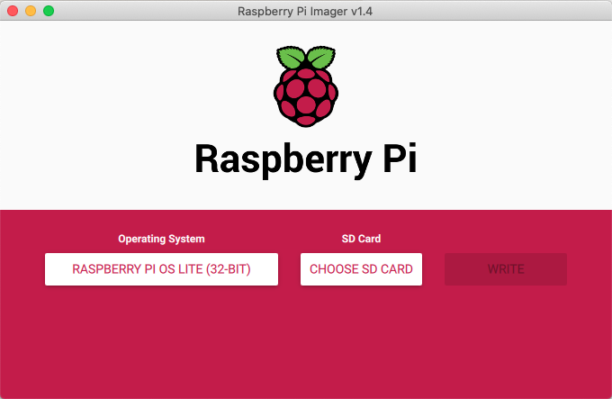

This is a guide primarily aimed for using the Pi as a headless mini PC for IOT type applications. If you want to setup a Pi for use as a desktop replacement, make sure you install the full Raspberry Pi OS, not the lite version as per these instructions.

### Step 1: Installing Raspberry Pi OS

I'm a big fan of doing things the easy way, and I really like the new official [Raspberry Pi Imager](https://www.raspberrypi.org/downloads/) tool. So I'd reccomend downloading this tool and selecting *Raspberry Pi OS Lite (32-bit)* from the dropdown list, its under Raspberry Pi OS (other). Raspberry Pi OS is the new name for Raspbian. We don't need a GUI so lets keep the install super light!



Once this has finished setting up your SD card, you will want to add an empty file named SSH to the boot section of the SD Card. You might need to re-insert the card as the installer ejects the SD Card. This file will allow us to do the rest of the setup over SSH over the network, which is a lot simpler than finding a spare screen, and keyboard.

If you are on a Mac or Linux machine you can create the SSH file using the following command - note that the file path might vary depending on your OS and mount paths:

```shell
#Mac OS
touch /Volumes/boot/ssh
#Linux
touch /media/boot/ssh
```

Insert the SD card into your Pi. Assemble your HAT, connect your GPS Antenna (if using) and plug in your ethernet cable and power up.

### Step 2. Raspberry Pi OS house keeping

Before we get too stuck in, lets do a few basic things before we get too far.

#### Find your Pi on the network

Firstly a tip for finding devices on your network. You can use the following command on a UNIX based machine to scan your subnet for attached devices - this makes it super easy to find the IP address assigned to the new device - ideally we should set up a DHCP reservation, and depenging on the use case for your Pi, a local domain name for it, but that falls outside the scope of this blog post!

```shell
sudo nmap -sP 192.168.0.0/24
```

*Where 192.168.0.X is your subnet (you may need to change this depending on your network configuration.*

This command will take about 30 seconds before it outputs a list of all the devices on your network, with their Mac Address, IP Address and manufacturer - you should then be able to spot your Raspberry Pi.

#### Connect to your Raspberry Pi over SSH

To connect to your Raspberry Pi, you can use the following command in your terminal. If you are using Windows you can use [PuTTY](https://www.chiark.greenend.org.uk/~sgtatham/putty/) or install the [linux subsystem](https://docs.microsoft.com/en-us/windows/wsl/install-win10).

```shell
ssh pi@192.168.0.XXX
```

Replace your with the IP address of your Pi. We are logging in with the user 'pi' whish is the default user set up in Raspberry Pi OS. You will get a prompt asking you want to continue:

```shell
The authenticity of host 192.168.0.99 can't be established.
RSA key fingerprint is 6a:de:e0:af:56:f8:0c:04:11:5b:ef:4d:49:ad:09:23.
Are you sure you want to continue connecting (yes/no)?
```

This is normal on your first connection so your can type Y or Yes and hit return.

You will then be prompted for a password which is 'raspberry'

#### Create a new user & delete the default user

Whilst you could just change the default password for the pi user, as everyone knows the default username is pi, we really should remove it. We will create a new user, but we have to make sure the new user is in the same groups as the existing pi user.

In the terminal type:

```shell
groups pi
```

This will list all the groups that the pi user is in and should look something like this:

```shell
pi adm dialout cdrom sudo audio video plugdev games users netdev input
```

We need to create a new user with the same group allocation. To do this we will use the **useradd** command. You'll need to copy the groups for your pi from the output above, without the pi group.

```shell
sudo useradd -m -G
adm,dialout,cdrom,sudo,audio,video,plugdev,games,users,netdev,input USERNAME
```

Where **USERNAME** is the username you are adding.

Note that the list of groups should have a comma separating them with no spaces. The username at the end is separated form the last group by a space.

Now we need to create a password for the new user using:

```shell
sudo passwd <username>
```

Enter in the new password when prompted.

Now we can use the **exit** command to log out of the ssh connection so that we can log back in with our new user

```shell
exit
logout
Connection to 192.168.0.XXX closed.
```

```shell
ssh USERNAME@192.168.0.XXX
```

Once you are logged back in, we can delete the pi user with the following command:

```shell
sudo deluser pi
```

#### Setting up Raspi-Config

Raspberry Pi OS comes with a configuration tool where we can set a few of the defaults up and ensure the Pi is optimised for our use.

Run raspi-config using the following command:

```shell
sudo raspi-config
```

TO BE CONTINUED...