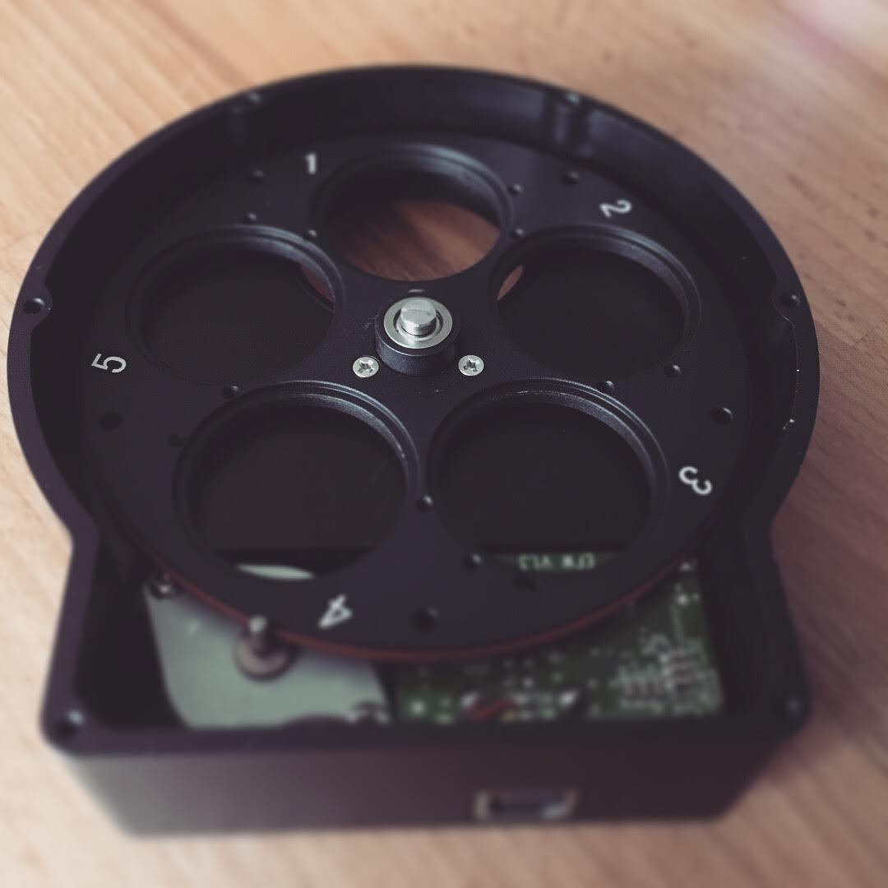

import bayer from '~/assets/images/why-mono-cameras-rule-astrophotography/bayer.png';

All digital cameras work by counting the number of photons of light that hit a pixel or ‘sensor well’. If zero photons hit the pixel, that pixel is black. The more photons, the less black that pixel of your image becomes. Eventually the sensor well will be come saturated, the maximum number of photons that particular sensor can measure will have been counted and the images starts to become over-exposed. This is why you have to change your aperture and shutter speed when taking photos.

## Bayer Filters

So far so good – the problem is that we haven’t invented a sensor well that can detect the wavelength of light that is hitting it, so we have no idea what colour the light hitting the sensor is. To get around this rather critical shortfall, all colour digital cameras use very small colour filters on each pixel. The colours used are red, green and blue and they are arranged in a grid so that each pixel can only measure light of one of those three colours, either red or green or blue. This is called a Bayer filter. Once the image is recorded, a clever bit of maths can be used to look at the values of each neighbouring pixel to determine the correct colour for each pixel.

<figcaption>Left: A typical Bayer pattern (it can vary). Right: How the light passes through a Bayer filter.</figcaption>

For most photography this works quite well – very occasionally some artefacts are visible when there is lots of fine detail, but for large blocks of colour it’s a really neat shortcut.

For astrophotography however there are a few issues with Bayer filters, firstly sensors are arranged in rectangular grids, which don’t easily divide by 3, so Bayer filters use 2 greens for each red and blue – this mimics human vision, we have evolved to more be sensitive to green than other colours – a throwback to our ancient ancestors to whom picking ripe fruit was a significant advantage. Being twice as sensitive to green is fine for terrestrial photography, but in space, at least at interstellar scales, there is almost no green light.

<figcaption>As the temperature of stars changes, so does their colour. Temperatures in Kelvin. Note the lack of green.</figcaption>

For photographs of deep space objects, the green half of our sensor is not being used at all, which is a bit of a waste – especially when you consider how dim some of these objects are – every photon counts!

The second issue with Bayer filters and astrophotography comes from the interpolation or maths required to reproduce a colour image. When taking a photo of an object, typically that object is large enough to cover thousands or even millions of pixels, and so there is lots of colour data available to calculate the correct colour of a particular part of an image. Simplistically, interpolation works by looking at the adjacent pixels in the pattern.

To understand how this works lets look at a single pixel on the sensor, in this example the filter over the pixel happens to be red. Calculating the red channel is easy as we already know how much red is in that pixel from its own sensor well, coupled with the red filter. To get blue and green, we need to look at all of the blue pixels that are only 1 pixel away, and average them, and for green, we look at each of the green pixels that are only 1 pixel away and average them. When this is applied to the entire sensor, we end up with a pretty good approximation of a colour image.

However with astrophotography, whilst we are taking photos of very large things (stars), they are extremely far away – often only taking up one pixel of our image.

With light only hitting a single pixel of the sensor, and very little on the neighbouring images, its very hard for the camera’s algorithms to calculate the correct colour of the stars – leading to more colour noise, and a less pleasing image. For nebulas and larger deep space targets this is a bit less of an issue.

The final issue with colour sensors has been touched upon already and its the lack of sensitivity – with each pixel covered by a filter that only allows roughly 25-30% of available wavelengths through, colour cameras are much less sensitive to light compared to a mono version of the same sensor. Mono astronomy cameras can be three to four times more sensitive to their colour counterparts.

## Colour images from a black & white camera?

So mono cameras are more sensitive, but how do you make colour images if you have a black and white sensor? Well actually the same way as colour cameras do, just with separate filters for red, green and blue that cover the entire sensor.

In my current setup[^1] I use four filters: Luminance (which is essentially a clear piece of glass), Red, Green and Blue – the Luminance is used so that focus doesn’t shift when shooting without a filter compared to using a filter. The filters are housed in an electronic filter wheel that can be controlled over USB – this makes it easy to set up a batch of images using each filter.

Using a filter wheel solves many of the Bayer filter’s issues, mainly that of colour accuracy, but it doesn’t really help with sensitivity – when using a colour filter you are effectively blocking 75%-80% of the spectrum and therefore making the camera a lot less sensitive to light. However there is a solution.

## LRGB Processing

It is possible to create a good colour image using just the RGB filters, but it will be a slow process – roughly 3 times slower than using a colour camera. But we can do some clever processing to really speed up the time needed to get an image.

Most astrophotography cameras allow you to do pixel ‘binning’ where you can reduce the resolution of the sensor by binning 4 pixels together to make a single large pixel – these blocks of 2×2 are 4 times more sensitive than a single pixel – this effectively negates the need for longer exposures when using the colour filters, but it means your resolution is also significantly reduced. The clever part comes when you combine the colour data from a low res RGB image, created by stacking multiple Red, Green & Blue frames together, with a high res image using luminance data only – the sharpness of the image comes from the brightness data in the Luminance image and the colour from the RGB image – and it works really well!

<figcaption>Crop of an LRGB image - note the star colours in the image.</figcaption>

## Narrowband Filters

The other large benefit of using filters is you don’t have to use LRGB filters, you can also use Narrowband filters – filters designed for specific wavelengths of light given off by different gasses in nebulas, the most common used are Hydrogen-Alpha, Sulphur II & Oxygen III.

Narrowband images are some of the most stunning astrophotographs around and many of the images taken by the Hubble Telescope were taken using Narrowband filters. Below is on of Hubble’s most famous images of the Eagle Nebula.

<figcaption>Pillars of Creation - Image Courtesy of NASA, ESA, and the Hubble Heritage Team.</figcaption>

To summarise what has become quite a long post, mono cameras give more control, allow for more interesting images to be captured and generally provide cleaner images than their colour counterparts, but the time required to process images taken with mono cameras is increased quite significantly.

[^1]: Astrophotography is one of those hobbies where there is always something else you can add or tweak and someone else always has a bigger telescope than you do…