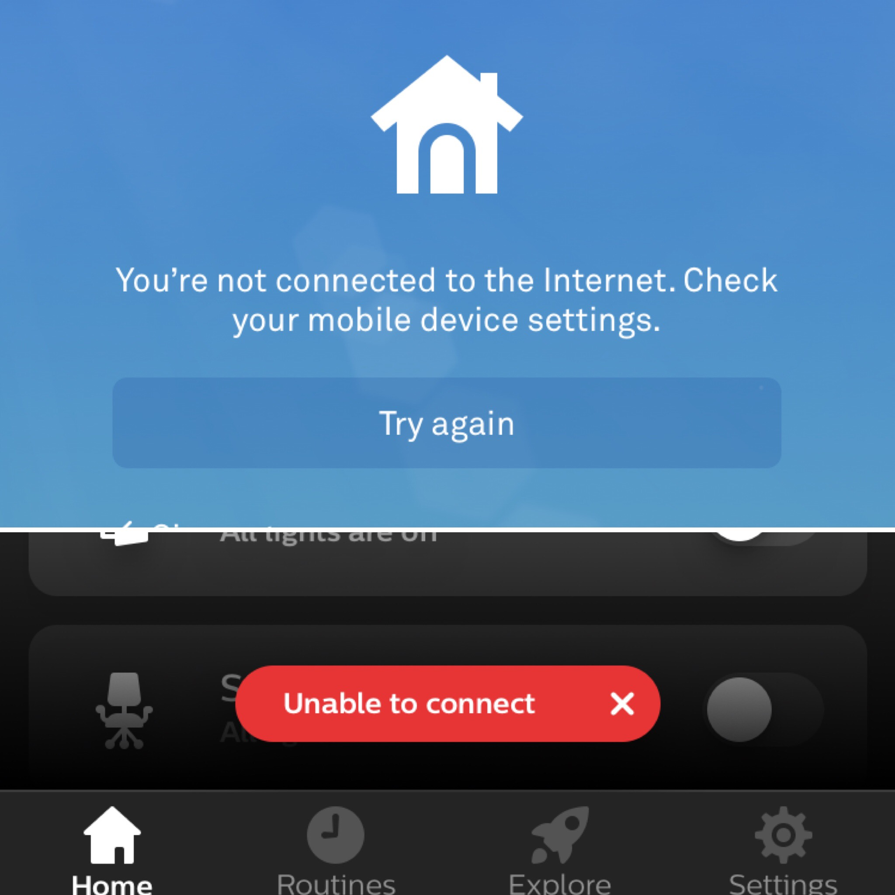

The idea of an intelligent home that understands your behaviour and routines – automatically controlling lighting, climate, entertainment and looking after your security – used to be science fiction. Now we are living in the future and it kind of sucks. Here are a few things I think are wrong with the current smart home reality.

## Smart doesn’t really mean smart

The first problem with current smart home tech is that manufacturers have started calling any device with basic internet connectivity or a connected smartphone app ‘smart’.

Take for example ‘smart’ TVs, does my TV know which member of my household is watching TV? Does it learn what I watch and when I watch it and offer recommendations or alert me when I’m about to miss my favourite TV show? Does it make suggestions about taking a break or standing up to improve my health in the middle of an 8 hour Netflix binge? That kind of thing would be smart, instead the minimum requirement seems to be that a smart TV can connect to the internet and that you can access Netflix or BBC iPlayer on it.

Smart plugs and smart lights offer the ability to be remotely turned on or off, smart thermostats do much the same thing as normal thermostats but with fancier displays and the ability to control it from your phone, or even by shouting at Alexa. What these devices really are is ‘connected’ – they have potential to become smart with the right controller, but by themselves they are not smart.

Even the professional home automation companies such as Control 4, Crestron & Lutron all showcase their touchscreen tablet apps as the way to control a smart home. Check out this video from Crestron to see what I mean:

    <iframe title="" src="https://www.youtube-nocookie.com/embed/GE051mAvSi4?rel=0" class="embedVideo-iframe" allowfullscreen="" style="border: 0px; position: absolute; top: 0px; left: 0px; width: 100%; height: 100%;"></iframe>

I would argue that’s not smart – it’s fancy sure, but if it takes longer to turn on a light than a it does to use an old fashioned light switch, then it’s not really an improvement. And if you forgot to charge your iPad it’s a significant problem!

## Closed APIs and ecosystems suck

The current state of consumer grade smart home tech is not one of unity and cross-compatibility. Instead the three largest players, Google, Amazon & Apple, each have their own solution and hope you’ll buy into their ecosystem and not one of their competitors. As a consumer you are effectively forced to pick a side and then choose devices that support your system. Some manufacturers have taken it upon themselves to support Amazon Alexa, Google Assistant & Apple’s HomeKit, but that’s three times the work and three times the cost of supporting just one, so these devices aren’t that common.

The next problem is that these giants in the tech world have a habit of buying up smaller companies to bolster their own ecosystem. Nest is one such company – one of the smart home pioneers with the first major smart thermostat and connected smoke detectors, was bought by Google in 2014. Nest had originally hoped it would be big enough to be the center of its own ecosystem, and had an API that allowed integration with other devices such as Google Assistant, Alexa, Hue lighting etc. This API even allowed the DIY enthusiasts to use a raspberry pi or similar as a bridge between Nest and Apple HomeKit, adding unsupported integration and capabilities. For a while Google didn’t change anything and it seemed like the Nest API would remain largely intact, however in May 2019, Google announced it would be killing the Nest API and bringing all the Nest devices into the Google ecosystem and forcing developers to rewrite all of their integrations to use Google Assistant instead.

This move might not have a huge impact on the average consumer who is unaware of what an API is, but for those of us hoping to turn our ‘connected’ Nest devices into ‘smart’ devices, we are out of luck. Whilst my expensive thermostat will still function, my ability to integrate it with the rest of my home just got a lot harder. With a single move, Google made the smart home world a little bit dumber.

### Embracing open standards

Instead of locking down devices to their own ecosystems wouldn’t it be amazing if manufacturers all supported a common, vendor independent open communication protocol? A protocol that supported a standard method for communication for common devices. Every thermostat would communicate using the same methods, every camera would provide images the same way. Software wouldn’t need to be written to work with a specific device, it would only need to support a standard camera, and all cameras would adhere to that standard. This might sound too good to be true, but it’s exactly what astronomers use to connect all their equipment…

ASCOM is an intermediate layer that sits between devices and software and defines a set of standards for many different devices such as cameras or focusers or mounts. Astrophotography software doesn’t need to support every single camera that’s made, it only needs to support a single standardised device. Camera manufacturers make their drivers work with the ASCOM standard and therefore it is automatically supported by the software: It’s a brilliant solution.

A small downside is that it can take longer to update the standard to support a new feature, but the benefits far outweigh this.

If such a system existed in the home automation world, it would solve a whole lot of problems; there could be a standard protocol for a light, for a motion sensor, switch, thermostat, security camera – it wouldn’t matter if you mixed and matched manufacturers and you’d be free to choose the controller that suited you best, be it Apple, Google, Amazon etc.

Whilst we don’t have an ASCOM for home automation, we can use a messaging system called Message Queuing Telemetry Transport (MQTT). MQTT is an ISO standard publish-subscribe-based messaging protocol. It is perfect for low bandwidth, low power devices, such as battery powered sensors. It works by having a broker, which is always running, that collects and passes on messages. So a low power device, like a light switch can publish a message to the broker, and a light controller that is subscribed to the light switch will then receive the message and turn on the appropriate light.

I’d really like to see more manufacturers support MQTT – it would allow a standard communication protocol, even if the message topics and contents might differ between devices.

### Reliance on the cloud instead of local processing

Another disappointing trend in smart home technologies is a tendency to rely on the cloud rather than doing local processing. I cannot change the temperature of my Nest thermostat from my phone whilst at home if the internet is down. There is really no good reason for this, other than its an extra bit of code to write to provide a local connection to the device. Instead, Nest relays all communications from the app to your thermostat through their servers. Most of the time this is fine, but what if Google, now owner of Nest, choose to turn off their servers? It wouldn’t be the first time they had pulled the plug on a product…

Another example of a product with an over reliance on the internet is a smart hub that I used to use called SmartThings. This was a device that promised to integrate with a lot of different devices and allow custom logic to be written – for example you could add door sensors and motion detectors and program the hub to turn on Hue lights. SmartThings was one of the early pioneers into the home automation space, before the likes of Amazon, Google and Apple got in on the game. At the time it was a small company with big ideas, but the system required an internet connection to do pretty much anything. Your motion sensor detected motion, told the hub, this told the server, the server ran the logic and told the hub to turn on the light, which then told the Hue hub to turn on the light. This works until the server goes offline for maintenance, or your internet connection drops out: Then you have no lights. When it did work, the round trip to a server and back added almost a two second delay between the sensor detecting motion and the light turning on.

A caveat, SmartThings has since been bought by Samsung and they may well have made improvements to how their system operates, the above was true when I used the system (circa 2015).

Google and Amazon’s smart home solutions are both based around voice assistants, and both require an internet connection to operate. No internet? No Alexa.

Of the three tech giants, Apple stands alone. HomeKit is quite different as it runs almost entirely locally – requiring either an old iPad or an Apple TV to run automations. Most HomeKit interaction is done locally – directly between devices. This difference in approach makes more sense when you look at how Apple does things – in recent years they’ve made privacy their unique selling point. What doesn’t need to be sent to the internet, isn’t sent to the internet.

### Privacy & security should not be afterthoughts

Apple are certainly leading the consumer electronics industry when it comes to privacy and security and have gone out of their way to keep data on iPhones where possible and anonymise it when its not.

Google have also jumped on the bandwagon, with Sundar Pichai, Google’s CEO recently announcing at Google IO 2019 that “Privacy should not be a luxury good”. But just two weeks later, The Irish Data Protection Commission has launched a probe to investigate if Google’s processing of personal data as part of advertising transactions (how Google makes money) is in breach of GDPR.

Whilst Jeff Bezos, CEO of Amazon, is suing the National Enquirer over an invasion of privacy, Amazon is developing a controversial facial recognition system that could allow governments to track their citizens every movement. It’s probably fair to say that privacy is not something Amazon feels strongly about.

The concern about privacy for home automation is that adding technology to your home should not make you more vulnerable or become a target of nefarious criminals. Imagine being able to buy leaked data that shows the daily habits of high net worth individuals – you could plan a burglary to coincide with when you know your target will be out. Or use such data to blackmail your target.

Perhaps you want to protect your home with a CCTV system? There are plenty of cheap internet connected cameras available online – some of these cameras cost as little as $20 with free cloud storage – you have to ask yourself, what’s the catch? How are they making any money? It surely cannot be from the hardware, so they must make money selling my data – and if that data is a 24/7 1080p video stream from inside your house, you should be a little concerned.

Security of Internet of Things (IOT) devices is another big problem – many of these devices are made by startups or Chinese manufacturers who can’t or won’t invest money into making sure the device remains secure. Many IOT devices will never see a security patch or update and many have security holes. Hackers constantly trawl the internet looking for connected devices with known security holes and add them to a large database / search engine called ‘Shodan’. Your IOT device may not only be insecure, but easy to find… Scary.

Network segregation is probably the only safe way to use IOT devices – you assume that all IOT devices can and will be compromised and make sure that they cannot see any other part of your network. This can be done with a separate physical network for IOT devices, or more commonly by setting up virtual networks (VLANs). Proper network segregation is not supported by consumer grade network hardware – nor is it ‘plug and play’; it requires a reasonable amount of knowledge about networks and firewalls. This is something that needs improving to make it more consumer friendly and will be critical to keep private data secure in the future.

## Open source & DIY to the rescue?

There are quite a few home automation projects under development in the open source world of the internet, some of them created by software engineers frustrated with the current state of affairs. Here are just a few worth mentioning.

### OpenHAB & Home Assistant

OpenHAB and Home Assistant are platforms that connect and integrate with a wide variety of devices including lights, speakers, thermostats and much more. Both offer mobile apps to see status and control devices connected to the system and both offer the ability to write automation scripts – the thing that makes your smart home smart.

[openHAB](https://www.openhab.org/)
[Home Assistant](https://www.home-assistant.io/)

### Node-RED

Node-RED is a flow-based visual programming tool developed originally by IBM for connecting hardware devices, APIs and online services as part of the IOT. Written in Node (JavaScript), this browser based programming tool is both simple to use and incredibly powerful and can be used to run complex automation rules.

[Node-RED](https://nodered.org/)

### Homebridge

Homebridge is a lightweight server that adds Apple HomeKit support to devices that don’t natively support HomeKit. For those of us who are impatient and don’t want to wait for support, or for devices that are unlikely to ever get support. If you are in the Apple ecosystem, Homebridge is well worth a look.

[Homebridge](http://homebridge.io/)

## Is there a glimmer of light in the future?

Of the three smart home giants, Amazon and Google are both pushing hard to take over our homes. Both have a range of smart home products that would cover much of what you might want to do. I don’t hold out much hope for Amazon becoming privacy friendly, but Google are starting to make the right noises.

Apple is definitely privacy focused, but lacks any home products of their own save for the HomePod, a high end speaker with a voice assistant that lags behind the others. Apple have both the resources and capabilities to create amazing home products, but whether they ever will is another matter.

We will probably never get a proper standard for home automation, and its in a company’s interest to lock you into their own ecosystem, but perhaps the world of open source and software engineers working on things in their spare time can get us most of the way there.

Whilst it may appear that we are stuck in a world of devices that won’t talk to each other, sell personal data to the highest bidder and stop working when your internet goes down, there is a glimmer of hope for the future.